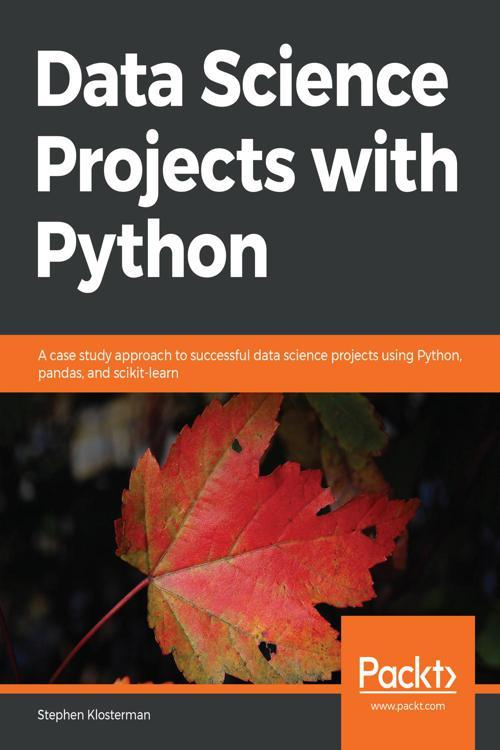

## 🔖 Sobre
Para esse trabalho utilizamos como fonte de estudo o livro Data Science Projects With Python escrito pelo professor [Stephen Klosterman](https://www.linkedin.com/in/stephenklosterman/). . Este livro é um ótimo conteúdo para quem deseja migrar para área de dados e/ou aprimorar os conhecimentos.
O “Data Science Projects with Python” consegue reunir os principais conceitos que surgiram ao longo dos anos para desenvolver(avaliar) modelos de Machine Learning. O livro é bem interessante, principalmente pelos exemplos Hand’s On, que exemplifica na prática o que muitas vezes é visto somente na teoria. 


- Análise exploratória
- Avaliação de modelos
- Construção de modelos
- Feature Engineering

</br>

<p align="center"> 
  
</p>

</br>

## 🚀 Bibliotecas utilizadas

- [Plotly](https://plotly.com/)
- [Numpy](https://numpy.org/)
- [Matplotlib](https://matplotlib.org/)
- [Pandas](https://pandas.pydata.org/)
- [Sklearn](https://scikit-learn.org/)


</br>

## 🗂 Como baixar e iniciar o projeto

```bash
# Abra um terminal e copie este repositório com o comando
$ git clone https://github.com/cbvreis/Book_Data-Science-Projects-with-Python-P.git
# ou use a opção de download.

pip install -r requirements.txt

# Entrar no diretorio **Book_Data-Science-Projects-with-Python-P**
$ cd Book_Data-Science-Projects-with-Python-P

```


<br>

Desenvolvido por [Cássio Reis](https://www.linkedin.com/in/cassioreisdevelop/) 🤓

